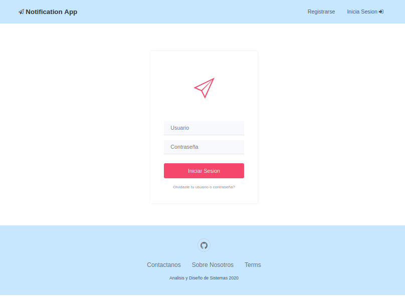
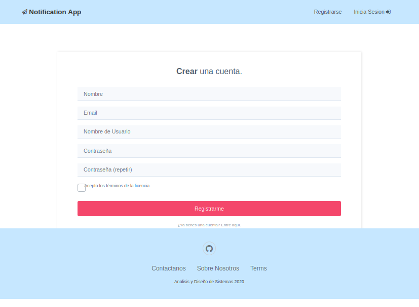
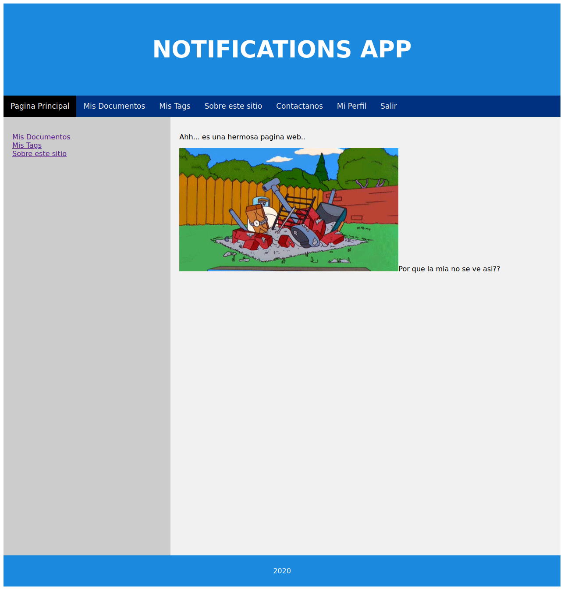
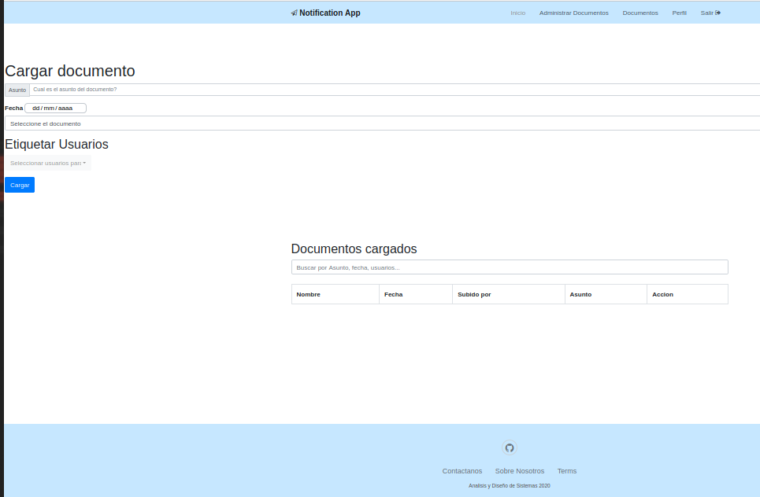
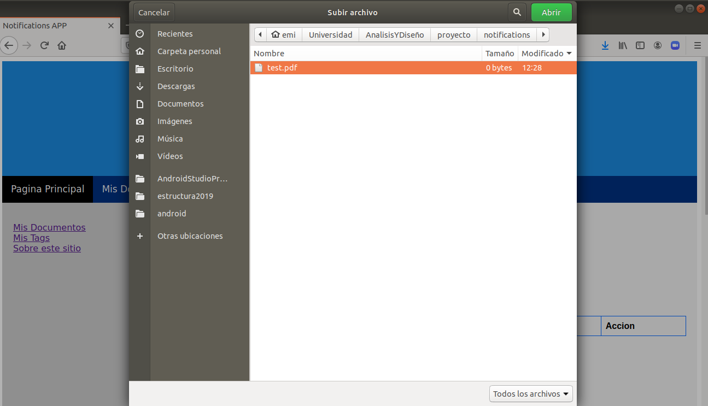
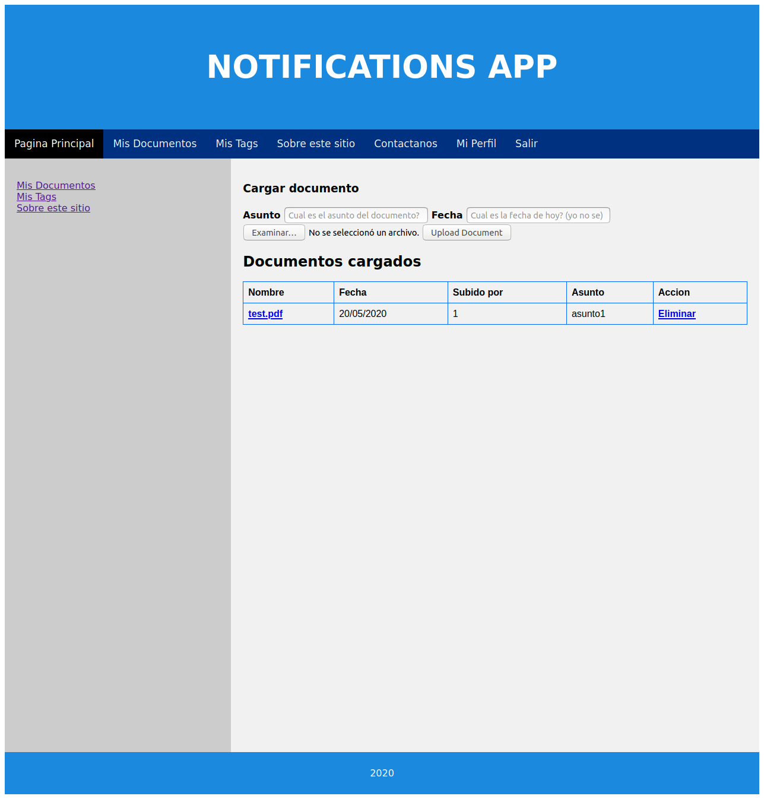
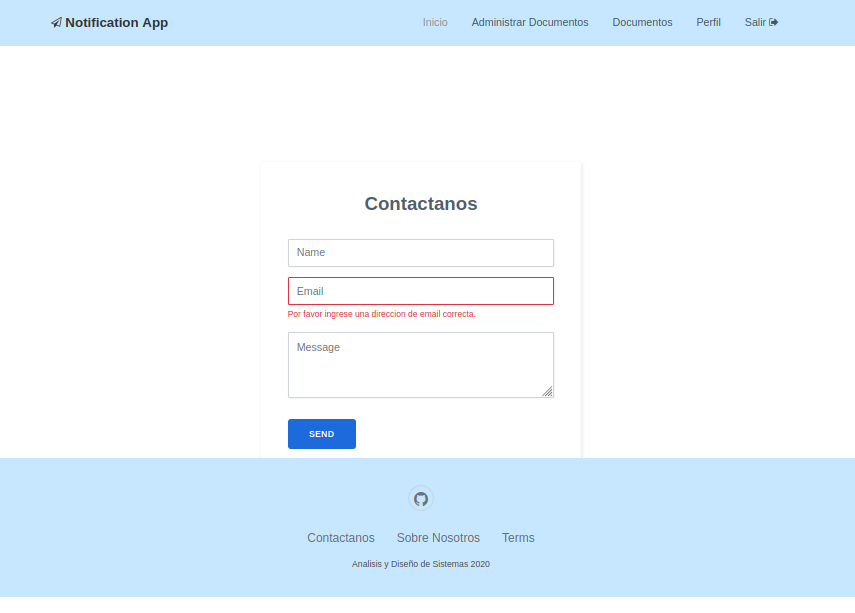

# Software Requirements Specification
## For Notification App

Version 0.1   
Prepared by Leonardo Gaitan, Juan Yachino and Emiliano Baez
<date created>  

Table of Contents
=================
* [Revision History](#revision-history)
* 1 [Introduction](#1-introduction)
  * 1.1 [Document Purpose](#11-document-purpose)
  * 1.2 [Product Scope](#12-product-scope)
  * 1.3 [Definitions, Acronyms and Abbreviations](#13-definitions-acronyms-and-abbreviations)
  * 1.4 [References](#14-references)
  * 1.5 [Document Overview](#15-document-overview)
* 2 [Product Overview](#2-product-overview)
  * 2.1 [Product Perspective](#21-product-perspective)
  * 2.2 [Product Functions](#22-product-functions)
  * 2.3 [Product Constraints](#23-product-constraints)
  * 2.4 [User Characteristics](#24-user-characteristics)
  * 2.5 [Assumptions and Dependencies](#25-assumptions-and-dependencies)
  * 2.6 [Apportioning of Requirements](#26-apportioning-of-requirements)
* 3 [Requirements](#3-requirements)
  * 3.1 [External Interfaces](#31-external-interfaces)
    * 3.1.1 [User Interfaces](#311-user-interfaces)
    * 3.1.2 [Hardware Interfaces](#312-hardware-interfaces)
    * 3.1.3 [Software Interfaces](#313-software-interfaces)
  * 3.2 [Functional](#32-functional)
  * 3.3 [Quality of Service](#33-quality-of-service)
    * 3.3.1 [Performance](#331-performance)
    * 3.3.2 [Security](#332-security)
    * 3.3.3 [Reliability](#333-reliability)
    * 3.3.4 [Availability](#334-availability)
  * 3.4 [Compliance](#34-compliance)
  * 3.5 [Design and Implementation](#35-design-and-implementation)
    * 3.5.1 [Installation](#351-installation)
    * 3.5.2 [Distribution](#352-distribution)
    * 3.5.3 [Maintainability](#353-maintainability)
    * 3.5.4 [Reusability](#354-reusability)
    * 3.5.5 [Portability](#355-portability)
    * 3.5.6 [Cost](#356-cost)
    * 3.5.7 [Deadline](#357-deadline)
    * 3.5.8 [Proof of Concept](#358-proof-of-concept)
* 4 [Verification](#4-verification)
* 5 [Appendixes](#5-appendixes)

## Revision History
| Name |  Date    | Reason For Changes  | Version   |
|NotApp| 26/03/20 | First Version       |   0.1     |
|      |          |                     |           |
|      |          |                     |           |
|      |          |                     |           |

## 1. Introduction

### 1.1 Document Purpose
The purpose of this document is to present a detailed description of the free-software Notification Apps software. It will explain the purpose and features of the software, the interfaces of the software, what the software will do and the constraints under which it must operate. This document is intended for users of the software and also potential developers.
### 1.2 Product Scope
Notifications Notifications is a tool that people can use to upload pdf files, from the official website of the Nacional of Rio Cuarto University. Users / administrators can use it tag other people who participate in a contest published by the same university.
This is a software for academic use only.
### 1.3 Definitions, Acronyms and Abbreviations

### 1.4 References
> 

>   

### 1.5 Document Overview
The following sections of the document talk about the description of the software and how it will be implemented.

## 2. Product Overview

### 2.1 Product Perspective
The development of the Notifications software is based on the knowledge acquired in the subject "Analysis and design of Systems", to comply with the digital loading of documents, treatment and sending of notifications, which consists of a web application. Documents are uploaded and users appearing in it are notified.

### 2.2 Product Functions
* Login
  - Allow a user to start a session.
  - Allow a user to register.
* Upload
  - Allow an administrator user to upload files from the UNRC official website.
* Tags
  - Allow an administrator user to tag other users in the different documents where it appears.

### 2.3 Product Constraints
* Have internet connection
* File storage space
* Restrictions by different platforms, such as browsers (Chrome, Firefox, etc.)

### 2.4 User Characteristics

### 2.5 Assumptions and Dependencies
* You do not have an internet connection.
* It does not have a mail synchronized with the UNRC.
* UNRC database.

## 3. Requirements

### 3.1 External Interfaces

#### 3.1.1 User interfaces

#### 3.1.2 Hardware interfaces

#### 3.1.3 Software interfaces

### 3.2 Functional
#### 3.2.1 Class
> Class Diagram (*Work In Progress*)

[Source](https://app.genmymodel.com/api/repository/juanyachino/TP%20AyDS2020)

### 3.3 Quality of Service

#### 3.3.1 Performance

#### 3.3.2 Security

#### 3.3.3 Reliability

#### 3.3.4 Availability

### 3.4 Compliance

### 3.5 Design and Implementation

#### 3.5.1 Installation

#### 3.5.2 Distribution

#### 3.5.3 Maintainability

#### 3.5.4 Reusability

#### 3.5.5 Portability

#### 3.5.6 Cost

#### 3.5.7 Deadline

#### 3.5.8 Proof of Concept

## 4. Verification

## 5. Appendixes
